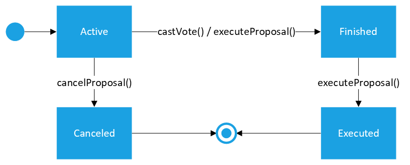

# Governança e Processos de Votação de Propostas

## USGOV01 - Administrador Global cria nova proposta para para que as organizações aprovem ou rejeitem alguma ação

Critérios de aceitação:
1. Somente Administradores Globais, vinculados a organizações ativas, podem criar propostas.
2. Administrador Global informa:
   1. Lista de endereços (*targets*) a serem chamados caso a proposta seja aceita.
   2. Lista de dados de chamada (*calldata*) a serem utilizados para cada um dos endereços informados.
   3. Limite de blocos para aprovação da proposta.
   4. Descrição da proposta.
3. As listaa de *targets* e *calldatas* devem ter o mesmo número de elementos.
4. A proposta é criada:
   1. Com identificador incremental gerado automaticamente.
   2. Com situação ativa.
   3. Com resultado indefinido.
   4. Vinculada a todas as organizações com direito de voto.
   5. São armazenados:
      1. O criador da proposta.
      2. A lista de *targets*.
      3. A lista de *calldatas*.
      4. A descrição da proposta.
      5. O bloco de criação da proposta.
      6. Limite de blocos para aprovação da proposta.
5. A ocorrência da criação da proposta deve emitir um evento, registrando:
   1. O identificador da proposta
   2. O criador da proposta
6. O identificador da proposta é retornado como resultado.

Dúvidas:
- Qualquer administrador global deve poder criar propostas? Ou somente administradores globais de organizações com direito a voto deveriam poder criar propostas?
  - **Resposta**: Seguindo os princípios do [Regulamento da RBB](https://github.com/RBBNet/rbb/blob/master/governanca/reunioes_comite_executivo/2022-11-29_reuniao/2022-11-29-Ata-Reuni%C3%A3o-Governan%C3%A7a-RBB-Assinada.pdf), qualquer organização pode apresentar propostas. Portanto, qualquer adminstrador global pode criar propostas.
- Deve-se permitir o envio do texto completo da descrição, dando margem ao registro de informações sensíveis, ou deve-se utilizar somente um hash da descrição?
  - **Resposta**: Considerando-se o perfil dos usuários que utilizarão a funcionalidade e privilegiando a transparência, será armazenada o texto da descrição.

## USGOV02 – Administrador Global cancela uma proposta para que não possa mais receber votos e nem ser executada

Critérios de aceitação:
1. Somente Administradores Globais ativos, vinculados a organizações ativas, podem cancear propostas.
2. O Administrador Global informa o identificador da proposta a ser encerrada e texto descritivo do motivo do cancelamento.
3. Somente Administradores Globais da mesma organização do criador da proposta podem realizar o cancelamento.
4. Somente propostas ativas podem ser canceladas.
5. A organização do administrador deve constar na lista de organizações vinculadas à proposta.
6. A proposta é marcada como cancelada.
   1. A ocorrência do cancelamento da proposta deve emitir um evento, registrando:
      1. O identificador da proposta

Dúvidas:
- Deve-se registrar a motivação do cancelamento?
  - **Resposta**: Sim, privilegiando-se a transparência e a auditabilidade.
- Somente o próprio criador pode cancelar a proposta ou deve-se permitir que qualquer Administrador Global da organização proponente o faça?
  - **Resposta**: Qualquer Administrador Global da organização proponente deve poder cancelar a proposta.
- Deve-se permitir o cancelamento de propostas com resultado definido?
  - **Resposta**: Sim, deve-se permitir, considerando que somente a organização proponente pode fazê-lo.

## USGOV03 – Administrador Global envia voto para apuração de resultado de proposta

Critérios de aceitação:
1. Somente Administradores Globais ativos, vinculados a organizações ativas, podem enviar voto.
2. Administrador Global informa o identificador da proposta e o valor de seu voto (aprovação ou rejeição).
3. A proposta tem que estar ativa.
4. A organização do administrador deve constar na lista de organizações vinculadas à proposta.
5. Somente pode haver um voto por organização.
6. O voto somente pode ser marcado até o limite de blocos estabelecido para a proposta. Caso o limite de blocos tenha sido ultrapassado:
   1. O voto é descartado.
   2. A proposta é marcada como encerrada.
   3. A ocorrência da finalização da proposta deve emitir evento, registrando:
      1. O identificador da proposta
   4. A história é encerrada retornando a indicação que o voto **não** foi registrado.
7. Registra-se o voto enviado para a organização do administrador.
8. A ocorrência do voto deve emitir um evento, registrando:
   1. O identificador da proposta
   2. O administrador votante
   3. O voto
9. Verifica-se se já é possível atingir maioria simples (metade mais uma das organizações da lista de proposta).
   1. Caso já exista maioria simples, registra-se o resultado da proposta, de aprovação ou rejeição.
   2. Caso todos os votos já tenham sido realizados e haja empate, registra-se o resultado da proposta como rejeição.
   3. A ocorrência da definição do resultado da proposta deve emitir um evento, registrando:
      1. O identificador da proposta
      2. O resultado da proposta
10. É retornada a indicação que o voto foi registrado.

Dúvidas:
- Deve-se permitir que uma organização sobrescreva seu voto?
  - **Resposta**: Tal requisito permite maior flexibilidade, porém aumenta a complexidade de implementação e a possibilidade de erros de codificação. Seguindo a ideia de que transações em blockchain não podem ser revertidas e priorizando a simplicidade, tal requisito não será implementado.

## USGOV04 – Administrador Global excuta proposta para que as ações aprovadas sejam realizadas

Critérios de aceitação:
1. Somente Administradores Globais ativos, vinculados a organizações ativas, podem cancear propostas.
2. O Administrador Global informa o identificador da proposta a ser encerrada.
3. Somente propostas ativas ou finalizadas podem ser executadas.
4. Somente propostas com resultado definido podem ser executadas.
5. A organização do administrador deve constar na lista de organizações vinculadas à proposta.
6. Caso a proposta ainda não tenha sido finalizada, a mesma é marcada como finalizada.
   1. A ocorrência da finalização da proposta deve emitir evento, registrando:
      1. O identificador da proposta
7. Os *targets* cadastrados para a proposta são chamados, na ordem que foram informados, com os respectivos *calldatas*.
8. A proposta é marcada como exectudada.
   1. A ocorrência da execução da proposta deve emitir um evento, registrando:
      1. O identificador da proposta
      2. O administrador executante

## USGOV05 – Observardor consulta proposta para avaliar sua situação

Critérios de aceitação:
1. Qualquer pessoa pode realizar a consulta.
2. Observador informa o identificador da proposta.
3. São retornados os dados cadastrais da proposta.

## USGOV06 – Observardor consulta votos realizados para uma proposta para avaliar sua situação

Critérios de aceitação:
1. Qualquer pessoa pode realizar a consulta.
2. Observador informa o identificador da proposta.
3. São retornados os votos realizados por cada organização participante.

## Dúvidas

- Deveria haver requisito para que os partícipes patronos pudessem vetar propostas, conforme previsto no [Regulamento da RBB](https://github.com/RBBNet/rbb/blob/master/governanca/reunioes_comite_executivo/2022-11-29_reuniao/2022-11-29-Ata-Reuni%C3%A3o-Governan%C3%A7a-RBB-Assinada.pdf)?
  - **Resposta**: Avaliou-se que o *smart contract* de governança não precisaria dessa funcionalidade, baseado na premissa de confiança que o processo decisório *off chain* da governança, onde os vetos deverão de fato ocorrer, será respeitado, não havendo efetivo cadastro de propostas já vetas ou rejeitadas no Comitê Executivo. Dessa maneira, mantém-se o *smart contract* com implementação mais simples.
  

## Diagramas

### Diagrama de estados de situação de uma proposta

### Diagrama de estados do resultado de uma proposta

